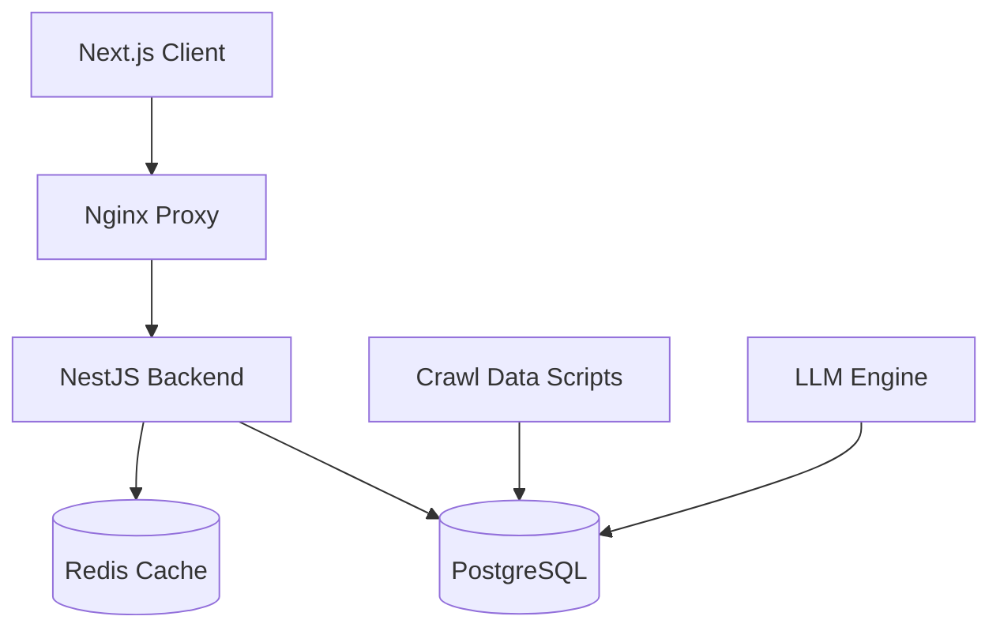

# System Architecture

The AQA (Academic Quality Assurance) project is organized as a **Turborepo monorepo** managed with `pnpm workspaces`. This structure allows for shared configurations and efficient builds across multiple applications and scripts.

---

## High-Level Diagram



---

## Monorepo Components

### 1. Applications (`apps/` conceptual, currently at root)

- **`aqa-client` (@aqa/client)**:
  - **Framework**: Next.js 14 (App Router).
  - **Styling**: Tailwind CSS & NextUI/HeroUI.
  - **State Management**: Zustand.
  - **Data Fetching**: Apollo Client (GraphQL) & SWR.
  - **Authentication**: NextAuth.js (v5 Beta).

- **`aqa-backend-nestjs` (@aqa/backend)**:
  - **Framework**: NestJS.
  - **API Type**: GraphQL (code-first approach).
  - **ORM**: TypeORM with `pg` driver.
  - **Authentication**: Passport.js with JWT and local strategies.
  - **Mailing**: Nodemailer.
  - **AI Integration**: Ollama and OpenAI clients.

### 2. Utilities & Scripts

- **`aqa-crawl-data` (@aqa/crawl-data)**:
  - **Language**: Node.js (JavaScript).
  - **Function**: Scripts to crawl academic data, lecturer surveys, and manage data transfers.
  - **Storage**: Direct PostgreSQL interaction via `pg`.

- **`aqa-llm` (@aqa/llm)**:
  - **Language**: Node.js (JavaScript).
  - **Function**: Logic for dataset generation, fine-tuning conversion, and interacting with Large Language Models.

---

## Infrastructure

- **PostgreSQL**: Primary relational database for all application data.
- **Redis**: Used for caching and session management within the NestJS backend.
- **Nginx**: Serves as a reverse proxy for the frontend and backend.
- **Prometheus & Grafana**: (Optional) Infrastructure monitoring.
- **cAdvisor**: Container monitoring for Docker.

---

## Repository Structure

```text
/
├── .github/workflows/    # CI/CD pipelines
├── aqa-backend-nestjs/   # NestJS source
├── aqa-client/           # Next.js source
├── aqa-crawl-data/       # Data scraping scripts
├── aqa-llm/              # LLM integration logic
├── docs/                 # Documentation (this folder)
├── package.json          # Root workspace config
├── pnpm-workspace.yaml   # Workspace definitions
└── turbo.json            # Turborepo task configuration
```
