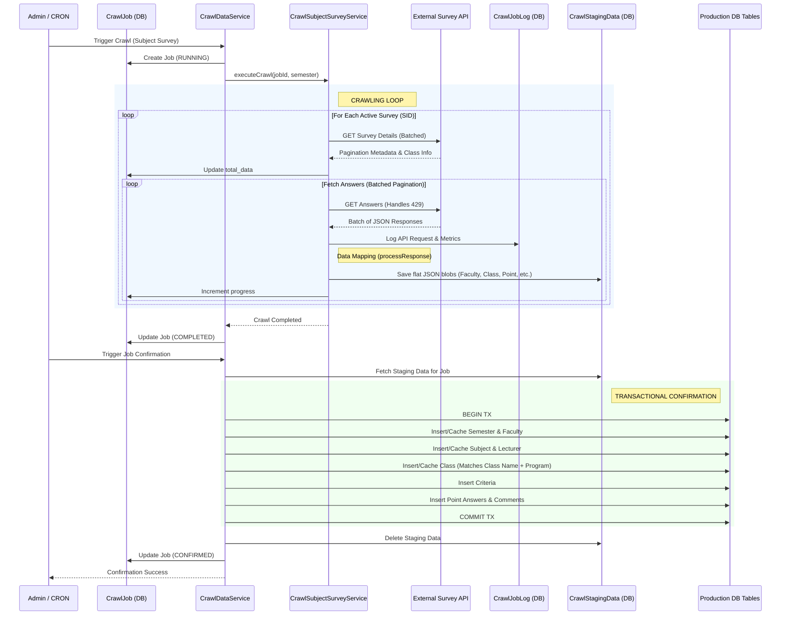

# Subject Survey Crawling System (Thu thập khảo sát môn học) - Documentation

This document describes the flow, data processing, and architecture of the current "Student Subject Survey" crawling system. This system connects to an external survey API to fetch data, processes answers, and stages them for database persistence.

## 1. Overall Crawling Flow & Architecture Paradigm

The following architecture diagram illustrates the end-to-end data flow, from initial trigger through external API extraction, staging, and final database confirmation.

The crawling process follows an asynchronous bulk extraction pattern, orchestrated into manageable batches to track progress reliably.

1. **Initialization:**
   - The crawl job starts by reading active survey configurations from the `SurveyListConfig` table (where `survey_type = 'SUBJECT_SURVEY'`). Optionally, it filters by a specific semester.
   - A `CrawlJob` entity is created, setting its status to `RUNNING`.

2. **Fetching Survey Details:**
   - For each active survey (identified by `sid`), the crawler first calls the `getSurveyDetail` endpoint.
   - It fetches results with pagination (e.g., 50 items limit per page). Batch requests (size of 5 page promises concurrently) are utilized to speed up data acquisition.
   - As details are fetched, they are mapped to extract class metadata (e.g., `class_name` and `program`) and used as reference data later.
   - Progress callbacks immediately report total expected records and fetched quantities back to the `CrawlJob` record tracking.

3. **Fetching Survey Answers (Responses):**
   - After fetching details, the system calls the `getSurveyAnswers` endpoint.
   - Like details, this endpoint is paginated and fetched concurrently in small batches to respect the remote API limits while maintaining speed.
   - Every fetched chunk is piped into an `onProgress` callback that actively processes the data and increments the job progress.

4. **Staging the Data:**
   - Instead of immediately committing to production tables or holding massive arrays in memory, each batch of fetched answers is converted into flat entity records using a data mapper (`processResponse`).
   - Mapped data records are stored in the `CrawlStagingData` table as JSON payloads associated with a specific `data_type`.

5. **Completion and Confirmation:**
   - Once API crawling completes across all surveys, the `CrawlJob` is marked as `COMPLETED`. 
   - A subsequent user action triggers job confirmation, which loops through the staging data, respects Foreign Keys, and systematically creates actual relational records (Classes, Subjects, Points, Comments, etc.) within a database transaction.

## 2. Counting & Progress Handling

Job monitoring and progress updating are handled using dynamic callbacks sent to the API Client:

- **Total Data Handling:** The exact total records number is not always fully known upfront across all surveys. When the first pagination request for a survey completes, it returns total available records. The system aggregates this `currentDetailTotal` and `currentAnswersTotal` dynamically onto a `globalTotalData` variable.
- **Progress Tracking:** The `fetchedCount` from API batches increments a `globalProgress` counter.
- **Job Status:** This data is periodically flushed (`update` on `crawlJobRepo`) allowing the frontend to represent the crawling speed, progress bar, and expected total size accurately in real-time.
- **Job Interruption Handling:** Before processing a new survey SID, the process checks if the job was manually stopped (`isJobRunning`). If terminated, it elegantly exits and reports current numbers. A background monitor checks inactivity (>10s) and fails stalled jobs.

## 3. Request Logging & Resiliency

All API traffic uses `SurveyApiClient`, which implements solid reliability paradigms:

- **Rate Limit Handling (429):** If hitting an API rate limit, the client backs off with an exponential delay pattern formula `(4 - retries) * 2000` ms, retrying up to 3 times before finally failing.
- **Timeouts & Security:** Configured to fail fast over 30 seconds to prevent thread stalling.
- **Activity Logging:** Every HTTP request to the external Survey system logs into `CrawlJobLog`. It logs payload, endpoint action, status code, execution duration inside milliseconds, and any error message, ensuring any structural API change or downtime is fully traceable.

## 4. Data Mapping Logic (API to Model)

The `processResponse` method parses the raw external JSON into structural entity schemas.

| Entity Type | Mapping Logic |
| :--- | :--- |
| **Faculty** (`faculty`) | Extracted directly from code: `nganhhoc` |
| **Subject** (`subject`) | Extracted directly from code: `tenmh`. Linked implicitly to the `faculty` name above. |
| **Lecturer** (`lecturer`) | Extracted from code: `tengv`. |
| **Semester** (`semester`) | Inherited directly from the currently processed `SurveyListConfig` entity. |
| **Class** (`class`) | Extracted from code: `mamh`. The `program` type is matched cross-referencing `class_name` against the *Survey Details* array fetched previously. |
| **Criteria** (`criteria`) | Scans all answer fields. Looks for `type === 'F'` grouping `sub_questions`. The sub-question string defines the criterion name. For standalone textual responses, extracts standard `question` names if not a known metadata code. |
| **Point Answer** (`point_answer`) | Maps answers (like `MH01`, `MH02`, `MH03`, `MH04`) from `sub_question_fields` into numbers (1, 2, 3, 4 respectively). These denote the student's rating for the specified criteria, tied directly to the `Class`. |
| **Comment** (`comment`) | Code `Q25` represents explicit textual Feedback/Open comments (tagged as `positive`). Code `Q26` represents `negative` feedback. Checks for non-empty string trimming. |

## 5. Aggregation and Production Saving

When staging data is "confirmed":
1. **Caching Layer:** A short-lived Map cache is instantiated to prevent duplicated SQL inserts within the same transaction runtime.
2. **Sequential Inserts:** Inserts run systematically from parent nodes to child nodes: `Semester` & `Faculty` -> `Subject` & `Lecturer` -> `Class` -> `Criteria` -> `Point` & `Comment`. Postgres `ON CONFLICT` patterns or quick `SELECT` statements are used to look up UUIDs.
3. **Aggregation phase (If applicable):** Specific crawl jobs (like `AGGREGATE_POINTS`) summarize all student answers per class per criteria into table summaries. Average points are calculated and the `participating_student` count on the `Class` entity is populated.
